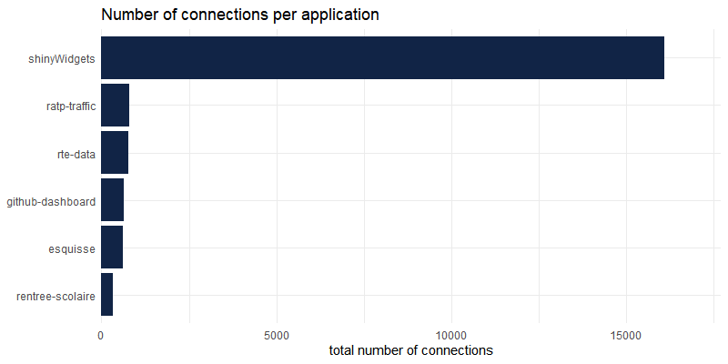
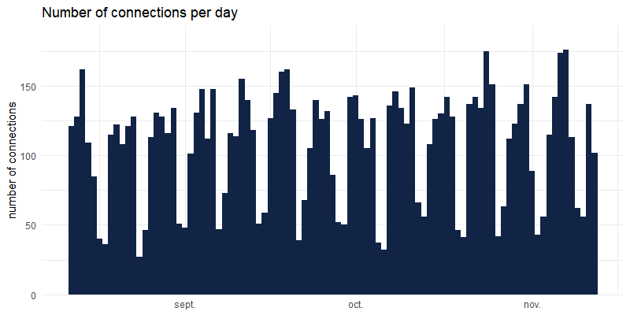
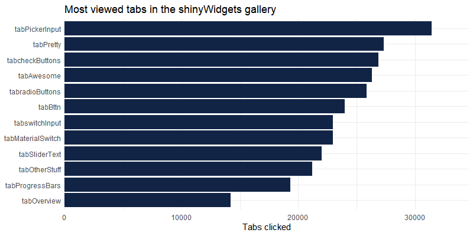
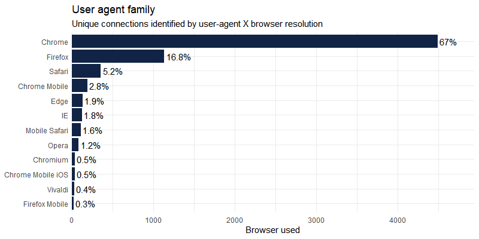
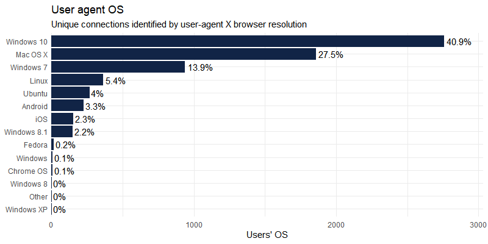

# shinylogs

> Record everything (almost) that happens in a 'Shiny' application browser side. Powered by [localForage](https://github.com/localForage/localForage).

[](https://travis-ci.org/dreamRs/shinylogs)
[](https://www.tidyverse.org/lifecycle/#maturing)
[](https://CRAN.R-project.org/package=shinylogs)
[](https://www.repostatus.org/#active)


## Installation

Install from CRAN with :

```r
install.packages("shinylogs")
```

Or install dev version from GitHub:

``` r
remotes::install_github("dreamRs/shinylogs")
```


## Usage

Call `track_usage` in your server function, it will record:

* *inputs* : each time an input change, name, timestamp and value will be saved
* *errors* : errors propagated through outputs
* *outputs* : each time an output is re-generated
* *session* : informations about the browser and the application

New inputs are created to expose those data, you can access them with `.shinylogs_input`, `.shinylogs_error`, `.shinylogs_output` and `.shinylogs_browserData`.
An additional input is also created to expose the last input modified by the user: `.shinylogs_lastInput`.

When application is closed (in fact on session ended), a JSON is created in a subfolder of app's directory.


Example:

```r
# Shiny server
function(input, output, session) {

  track_usage(storage_mode = store_json(path = "logs/"))
  
}
```

Example of JSON created (with the [Kmeans example app](https://shiny.rstudio.com/gallery/kmeans-example.html))

```
{
   "inputs":[
      {
         "name":"ycol",
         "timestamp":"2019-04-07T13:39:40+02:00",
         "value":"Sepal.Width",
         "type":"",
         "binding":"shiny.selectInput"
      },
      {
         "name":"ycol",
         "timestamp":"2019-04-07T13:39:35+02:00",
         "value":"Petal.Width",
         "type":"",
         "binding":"shiny.selectInput"
      },
      {
         "name":"clusters",
         "timestamp":"2019-04-07T13:39:37+02:00",
         "value":5,
         "type":"shiny.number",
         "binding":"shiny.numberInput"
      },
      {
         "name":"xcol",
         "timestamp":"2019-04-07T13:39:33+02:00",
         "value":"Sepal.Length",
         "type":"",
         "binding":"shiny.selectInput"
      },
      {
         "name":"clusters",
         "timestamp":"2019-04-07T13:39:37+02:00",
         "value":4,
         "type":"shiny.number",
         "binding":"shiny.numberInput"
      },
      {
         "name":"ycol",
         "timestamp":"2019-04-07T13:39:38+02:00",
         "value":"Species",
         "type":"",
         "binding":"shiny.selectInput"
      },
      {
         "name":"clusters",
         "timestamp":"2019-04-07T13:39:37+02:00",
         "value":5,
         "type":"shiny.number",
         "binding":"shiny.numberInput"
      },
      {
         "name":"xcol",
         "timestamp":"2019-04-07T13:39:32+02:00",
         "value":"Sepal.Width",
         "type":"",
         "binding":"shiny.selectInput"
      }
   ],
   "errors":[
      {
         "name":"plot1",
         "timestamp":"2019-04-07T13:39:39+02:00",
         "error":"NA/NaN/Inf in foreign function call (arg 1)"
      }
   ],
   "outputs":[
      {
         "name":"plot1",
         "timestamp":"2019-04-07T13:39:41+02:00",
         "binding":"shiny.imageOutput"
      },
      {
         "name":"plot1",
         "timestamp":"2019-04-07T13:39:35+02:00",
         "binding":"shiny.imageOutput"
      },
      {
         "name":"plot1",
         "timestamp":"2019-04-07T13:39:33+02:00",
         "binding":"shiny.imageOutput"
      },
      {
         "name":"plot1",
         "timestamp":"2019-04-07T13:39:37+02:00",
         "binding":"shiny.imageOutput"
      },
      {
         "name":"plot1",
         "timestamp":"2019-04-07T13:39:32+02:00",
         "binding":"shiny.imageOutput"
      },
      {
         "name":"plot1",
         "timestamp":"2019-04-07T13:39:37+02:00",
         "binding":"shiny.imageOutput"
      }
   ],
   "session":[
      {
         "app":"kmeans-example",
         "user":"pvictor",
         "server_connected":"2019-04-07T13:39:30+0200",
         "sessionid":"e32af32f5b664b6db175aaac1e0cd70a",
         "server_disconnected":"2019-04-07T13:39:42+0200",
         "user_agent":"Mozilla/5.0 (Windows NT 10.0; Win64; x64) AppleWebKit/537.36 (KHTML, like Gecko) Chrome/73.0.3683.86 Safari/537.36",
         "screen_res":"1920x1080",
         "browser_res":"1273x909",
         "pixel_ratio":1,
         "browser_connected":"2019-04-07T13:39:31+02:00"
      }
   ]
}
```


## Graphical examples of recorded outputs

Data recorded on our Shiny-Server available here: http://shinyapps.dreamrs.fr/






Which tabs in [shinyWidgets](https://github.com/dreamRs/shinyWidgets) gallery are the most seen : 




User-agent is recorded per connections and can be parsed with [uaparserjs](https://github.com/hrbrmstr/uaparserjs) :
(unique users are not registered as we use the open source version of shiny-server)





